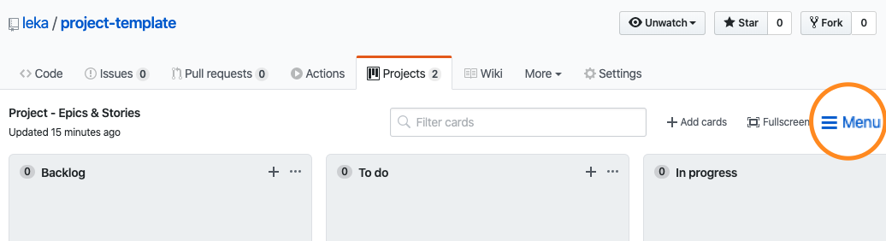
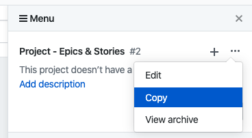

# Project Template

## About

This repository can & should be used as a template for creating new repositories.
Labels, projects, automations are being tested and added so that other repositories can use it as well.

## Labels

The basic labels used in a project are as follows:

```json
[
  {
    "name": "01 - type: bug",
    "description": "Something isn't working",
    "color": "E55934"
  },
  {
    "name": "01 - type: question",
    "description": "Further information is requested",
    "color": "D876E3"
  },
  {
    "name": "01 - type: epic",
    "description": "General discussion about futur and current topics",
    "color": "96D6F2"
  },
  {
    "name": "01 - type: story",
    "description": "Clear roadmap to implement a new feature, refactor code, etc.",
    "color": "78CBEE"
  },
  {
    "name": "01 - type: task",
    "description": "Something to do, e.g. fix a bug, implement a feature, add documentation, etc.",
    "color": "5BC0EB"
  },
  {
    "name": "90 - priority: high",
    "description": "High priority subject",
    "color": "E55934"
  },
  {
    "name": "90 - priority: low",
    "description": "Low priority subject",
    "color": "EE957D"
  },
  {
    "name": "90 - priority: medium",
    "description": "Medium priority subject",
    "color": "E97758"
  },
  {
    "name": "99 - status: backlog",
    "description": "Task, story or epic to discuss before starting",
    "color": "C4C4C4"
  },
  {
    "name": "99 - status: done",
    "description": "Bug fixed or completed task, story or epic",
    "color": "9BC53D"
  },
  {
    "name": "99 - status: in progress",
    "description": "Work in progress",
    "color": "FDEF8D"
  },
  {
    "name": "99 - status: review approved",
    "description": "PR has been approved",
    "color": "FFCD03"
  },
  {
    "name": "99 - status: review needed",
    "description": "PR needs review",
    "color": "FFDF5B"
  },
  {
    "name": "99 - status: to do",
    "description": "Task, story or epic ready to be tackled",
    "color": "00ccff"
  },
  {
    "name": "99 - status: won't fix",
    "description": "This will not be worked on",
    "color": "FFFFFF"
  }
]
```

The up-to-date list is in [`scripts/import-labels.js`](./scripts/import-labels.js).

They have different use:

- `01 - type:` - type of the issue being opened, it must be unique
- `90 - priority:` - priority of the issue, usually only used for `high priority`
- `99 - status:` - progress status, it is automatically updated when the issue is in a project

You can then add all the labels you need. It's a good idea to keep them numbered if you want to see them listed in a specific order.

## Projects

There are two base projects that can (or should?) be used:

- {Project name} - Tasks, Bugs & PRs
- {Project name} - Epics & Stories

You can customize the `{Project name}` as you wish and then update it in [`.github/projects-status-labels.yml`](.github/projects-status-labels.yml).

### Import project to another repository

To copy the project template to a new repository:

- visit one of the projects' page
- click on the `Menu` item on the left
- then on the `...`
- and select `Copy`




## Automations

### Project Autolabeling

When moving cards in a project, [status labels](#labels) will automatically be added and removed. But the contrary is not true: adding a label won't move the card in the corresponding column.

To do that, we are using:

- https://github.com/technote-space/auto-card-labeler/

## License

Copyright (c) APF France handicap & Ladislas de Toldi. All rights reserved.

Licensed under the Apache-2.0 license.